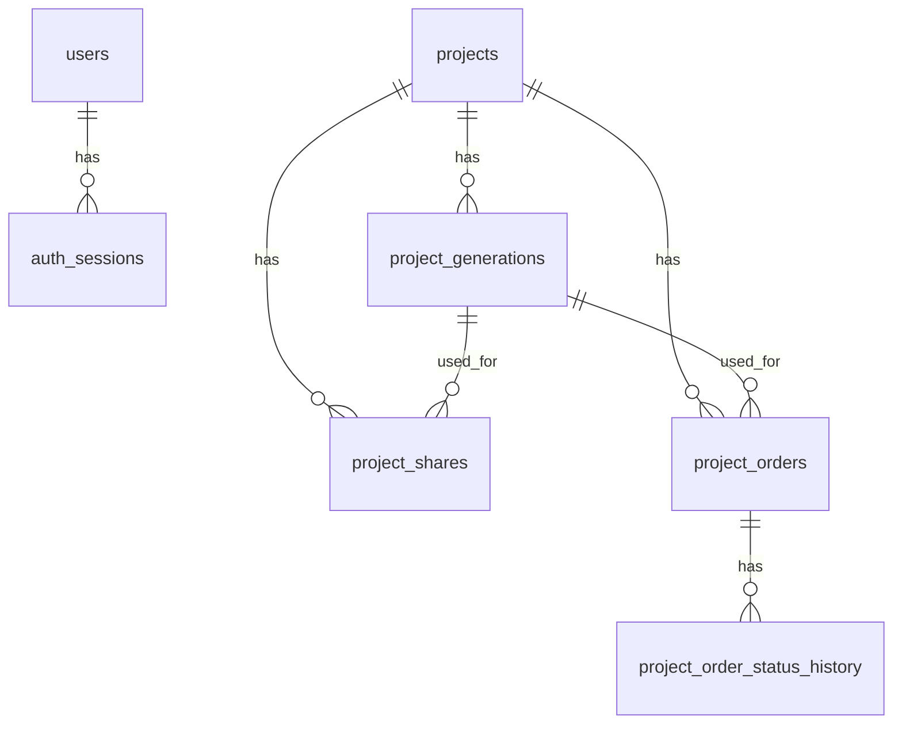

# Схема БД Mozaika

Дата обновления: 2026-02-24

## Назначение
База хранит:
- справочники (цвета чипов, цвета затирки, настройки);
- пользователей и сессии авторизации;
- проекты и историю генераций;
- share-ссылки;
- предварительные заказы и историю статусов.

## ER (укрупненно)

## Таблицы

### `app_settings`
- `id` (PK, int, фиксированно `1`)
- `default_field_width_mm` (double)
- `default_field_height_mm` (double)
- `default_cell_size_mm` (double)
- `default_gap_mm` (double)
- `created_at` (datetime)
- `updated_at` (datetime)

### `colors`
- `id` (PK, int)
- `name` (varchar(120), unique)
- `ral_code` (varchar(32), index)
- `rgb_hex` (char(7), index)
- `is_active` (bool)
- `created_at` (datetime)

### `grout_colors`
- `id` (PK, int)
- `name` (varchar(80), unique)
- `rgb_hex` (char(7), unique)
- `is_active` (bool)
- `created_at` (datetime)

### `users`
- `id` (PK, int)
- `username` (varchar(120), unique)
- `display_name` (varchar(180))
- `password_hash` (varchar(260))
- `password_salt` (varchar(260))
- `password_iterations` (int)
- `role` (varchar(24), index)
- `is_active` (bool)
- `created_at` (datetime)
- `updated_at` (datetime)

### `auth_sessions`
- `id` (PK, bigint)
- `user_id` (FK -> `users.id`, cascade delete)
- `token_hash` (varchar(128), unique)
- `created_at` (datetime)
- `expires_at` (datetime, index)
- `last_seen_at` (datetime)
- `is_revoked` (bool)

### `projects`
- `id` (PK, int)
- `name` (varchar(120))
- `description` (varchar(1200))
- `source_image_mime_type` (varchar(64))
- `source_image_bytes` (blob)
- `active_generation_id` (nullable FK-ссылка по логике приложения + cleanup trigger)
- `created_at` (datetime)
- `updated_at` (datetime, index)

### `project_generations`
- `id` (PK, int)
- `project_id` (FK -> `projects.id`, cascade delete)
- `version` (int, unique в паре с `project_id`)
- `name` (varchar(140))
- `note` (varchar(1200))
- `snapshot_json` (text/json)
- `created_at` (datetime, index)

### `project_shares`
- `id` (PK, int)
- `project_id` (FK -> `projects.id`, cascade delete)
- `generation_id` (FK -> `project_generations.id`, restrict delete)
- `generation_version` (int)
- `generation_name` (varchar(140))
- `token` (varchar(200), unique)
- `created_at` (datetime)
- `expires_at` (nullable datetime)
- `is_revoked` (bool)
- `created_by` (varchar(120))

### `project_orders`
- `id` (PK, int)
- `project_id` (FK -> `projects.id`, cascade delete)
- `generation_id` (FK -> `project_generations.id`, restrict delete)
- `generation_version` (int)
- `generation_name` (varchar(140))
- `created_at` (datetime)
- `updated_at` (datetime)
- `status` (varchar(24), index)
- `status_comment` (varchar(1200))
- `customer_name` (varchar(180))
- `customer_email` (varchar(180))
- `customer_phone` (varchar(64))
- `comment` (varchar(2400))
- `submitted_by` (varchar(120))
- `total_price` (double)
- `currency` (varchar(8))
- `total_chips` (int)
- `colors_used` (int)

### `project_order_status_history`
- `id` (PK, bigint)
- `order_id` (FK -> `project_orders.id`, cascade delete)
- `status` (varchar(24))
- `status_comment` (varchar(1200))
- `changed_by` (varchar(120))
- `created_at` (datetime)

## Правила хранения данных
- `snapshot_json` хранит полный слепок студии на момент сохранения генерации (мозаика + параметры + фильтры цветов + zoom/pan).
- Исходное изображение проекта хранится внутри БД в `source_image_bytes`, а не в файловой системе.
- История версий проекта реализована через `project_generations` с монотонным `version`.
- Share-ссылка всегда привязана к конкретной сохраненной генерации.
- Предварительный заказ фиксирует цену и метрики генерации на момент отправки.

## Индексы, критичные для производительности
- `projects(updated_at)`
- `project_generations(project_id, version)` (unique)
- `project_shares(token)` (unique)
- `project_orders(project_id, created_at)`
- `project_orders(status)`
- `auth_sessions(token_hash)` (unique)
- `auth_sessions(expires_at)`
